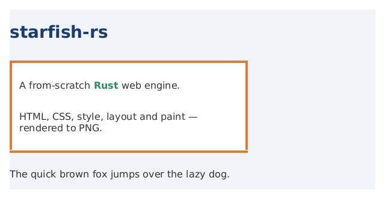

# starfish-rs

A from-scratch reimplementation of the [Starfish](https://github.com/Samsung/lightweight-web-engine) lightweight web engine, written in Rust.

**Goal (milestone 1 target):** render a static HTML page to a PNG — the classic browser rendering pipeline, no JavaScript yet.

```
HTML  ──parse──▶  DOM  ──┐
                         ├─▶  Styled tree  ──layout──▶  Box tree  ──paint──▶  PNG
CSS   ──parse──▶  CSSOM ─┘
```

## Workspace layout

| Crate | Responsibility |
|-------|----------------|
| `starfish-dom`    | DOM node tree, node types |
| `starfish-html`   | HTML tokenizer + tree builder → DOM |
| `starfish-css`    | CSS tokenizer + parser → stylesheets |
| `starfish-style`  | Cascade, specificity, computed values → styled tree |
| `starfish-layout` | Box tree, block/inline layout |
| `starfish-paint`  | Rasterize via `tiny-skia` → PNG |
| `starfish-cli`    | `starfish` binary: drives the pipeline |

## Status

**Epics 1–6 complete** — the engine fetches a page by URL, runs its JavaScript, and
renders the resulting HTML+CSS (grid, transforms, real fonts, bidi) to PNG end to end.
Render a local file, or a remote URL:

```sh
cargo run -p starfish-cli -- render docs/examples/demo.html -o out.png --width 640
cargo run -p starfish-cli -- render https://example.com -o out.png --width 800
```



**Epic 1** (static pipeline): HTML→DOM, CSS parsing, the cascade, block + inline
flow layout, paint to PNG.
**Epic 2** (coverage + images): text-decoration, list markers, real inline-block,
float/clear, position (relative/absolute/fixed), flexbox, `` (PNG/JPEG),
linear-gradient backgrounds, border-radius, box-shadow, opacity.
**Epic 3** (networking & resources): a `ResourceLoader` over `file://`, `http(s)://`
(ureq + rustls), and `data:` URLs; `<link rel=stylesheet>` loaded in document order;
remote/`data:` images; an in-memory fetch cache.
**Epic 4** (JavaScript): the Boa engine runs `<script>`s against DOM bindings
(document/Element/Node, querySelector, createElement, element.style), with events
(addEventListener/dispatchEvent, DOMContentLoaded/load) and bounded setTimeout/
setInterval; the run-to-quiescence DOM state is what gets rendered.
**Epic 5** (Grid & transforms): CSS Grid (`grid-template-columns/rows` with fr/repeat,
gap, line/area placement, alignment) and 2D `transform` (translate/scale/rotate/skew/
matrix + transform-origin, paint-time).
**Epic 6** (Text & typography): real font selection (fontdb system fonts + vendored
fallback, font-family/style/weight, per-face metrics), `@font-face` web fonts loaded over
the ResourceLoader, and bidi/RTL reordering + letter/word-spacing + text-transform +
white-space (pre/nowrap/pre-wrap/pre-line).

567 tests across the crates; `cargo clippy --all-targets -- -D warnings` is clean.
Roadmaps: [Epic 1](docs/ROADMAP.md), [Epic 2](docs/ROADMAP-epic2.md),
[Epic 3](docs/ROADMAP-epic3.md), [Epic 4](docs/ROADMAP-epic4.md),
[Epic 5](docs/ROADMAP-epic5.md), [Epic 6](docs/ROADMAP-epic6.md). Per-milestone design
notes in [docs/design/](docs/design/); rendered examples in [docs/examples/](docs/examples/).

## Approach

Built incrementally, one milestone at a time. Each milestone runs through a fixed pipeline of
specialized agents — **design → analysis → implementation → review → verification** — and lands as
its own commit. Third-party crates differ from the original C++ engine's (e.g. `tiny-skia` instead
of cairo/GL); the JavaScript engine (Escargot upstream) is deferred and abstracted behind an
interface for now.

## License

MIT — see [LICENSE](LICENSE).
